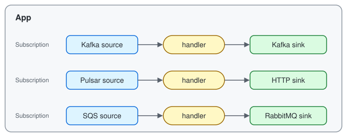

# beave-rs

[](https://crates.io/crates/beavers)
[](https://docs.rs/beavers)
[](https://github.com/cafeal/beave-rs/actions/workflows/ci.yml)
[](#license)

A lightweight Rust message processing framework built around typed handlers.

<p align="center">
  
</p>

Each `Subscription` connects one source, one handler, and one sink. An `App`
runs any number of subscriptions side by side and shuts them down together.

- **Typed handlers** — write `async fn(Input) -> Result<Output>`; decoding,
  publishing, and acknowledgement are handled for you.
- **At-least-once delivery** — an input is acknowledged only after its output
  is published.
- **Explicit failure handling** — classify errors as retry, reject
  (dead-letter), or fatal; retries back off.
- **Concurrency with ordering** — bounded concurrency, per-key ordering, and a
  worker pool for blocking handlers.
- **Pipelines** — chain subscriptions through in-process channels with
  end-to-end acknowledgement.
- **Adapters** — Kafka, Apache Pulsar, RabbitMQ, Amazon SQS, and HTTP; JSON,
  Avro, and Protobuf codecs.
- **Operations** — graceful shutdown, `tracing` spans, `metrics`,
  OpenTelemetry trace propagation, and `/livez` and `/readyz` probes.

> beave-rs is pre-release. The API may change until 0.1.0.

## Installation

```sh
cargo add beavers --features kafka
cargo add tokio --features macros,rt-multi-thread
cargo add anyhow
```

No Cargo feature is enabled by default. Enable the adapters and codecs the
application uses:

| Feature | Enables |
|---|---|
| `kafka` | Kafka source and sink |
| `pulsar` | Apache Pulsar source and sink |
| `rabbitmq` | RabbitMQ source and sink |
| `sqs` | Amazon SQS source and sink |
| `http` | HTTP source and sink |
| `avro` | Avro codec |
| `protobuf` | Protobuf codec |
| `opentelemetry` | Trace-context propagation through broker metadata |
| `health` | `/livez` and `/readyz` endpoints |
| `testing` | Fabricated broker records for handler tests |

## Quick start

Summarize each article on a Kafka topic with an LLM and publish the summaries
to another topic:

```rust
use beavers::{
    App, Classify, Result, Utf8,
    adapters::kafka::{KafkaSink, KafkaSinkConfig, KafkaSource, KafkaSourceConfig},
};

async fn summarize(article: String) -> Result<String> {
    let summary = call_llm(&format!("Summarize: {article}")).await.retry()?;
    Ok(summary)
}

#[tokio::main]
async fn main() -> anyhow::Result<()> {
    let articles = KafkaSource::<Utf8, _>::new(KafkaSourceConfig::new("localhost:9092", "summarizer", ["articles"]));
    let summaries = KafkaSink::<Utf8, _>::new(KafkaSinkConfig::new("localhost:9092", "summaries"));

    App::new()
        .subscribe("summarize", articles, summaries, summarize)
        .run()
        .await?;
    Ok(())
}
```

The handler sees only the decoded value. A transient API failure is retried
with backoff, and each offset is committed after its summary is published.

The repository's examples run against local brokers started with Docker
Compose, which also provides web consoles for Kafka and Pulsar:

```sh
docker compose up -d --wait
cargo kafka-produce
cargo kafka-process   # Ctrl-C to stop
docker compose down
```

To try the API without a broker, run `cargo run --example transform`. See
[local development brokers](docs/development.md) for every example, console,
and Cargo alias.

## Documentation

- [Documentation index](docs/README.md)
- [Adapters and usage examples](docs/adapters.md)
- [Codecs and serialization](docs/codecs.md)
- [Architecture and trait contracts](docs/architecture.md)
- [Runtime behavior, configuration, and limitations](docs/runtime.md)
- [Design plan and roadmap](docs/plan.md)
- [Local development brokers](docs/development.md)
- [Versioning and releases](docs/releasing.md)

## Development

The minimum supported Rust version is 1.94.1. See
[local development brokers](docs/development.md) for the local Kafka, Pulsar,
RabbitMQ, and SQS environment and the live tests, and
[AGENTS.md](AGENTS.md) for the checks every change must pass.

## License

Licensed under the [MIT license](LICENSE-MIT).

**Let application code process events. Let beave-rs manage the flow.**
